# Projet Angular – Mise en pratique

Ce projet a été réalisé dans le but de mettre en pratique les concepts fondamentaux du développement frontend avec Angular.

Il s'agit d'une application simple de gestion de produits permettant de consolider les notions apprises en cours, notamment la création de composants, la manipulation des données, le data binding et l'utilisation des services.

# Objectif du projet

L'objectif principal de ce travail est de :

- Appliquer les bases d'Angular dans un projet concret
- Comprendre l'architecture basée sur les composants
- Manipuler les données dynamiquement dans l'interface utilisateur
- Mettre en place une logique de séparation entre composants et services
- Simuler une première intégration frontend (et préparation backend)

  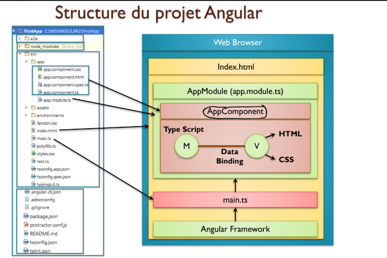
# Étapes réalisées
## Installation de Node.js et Angular cli-

Avant de commencer avec Angular, il est nécessaire d'installer Node.js et de vérifier que tout est correctement configuré.

Après l'installation de Node.js, nous avons installé Angular CLI, un outil essentiel pour créer et gérer les projets Angular.

### Commande d'installation :

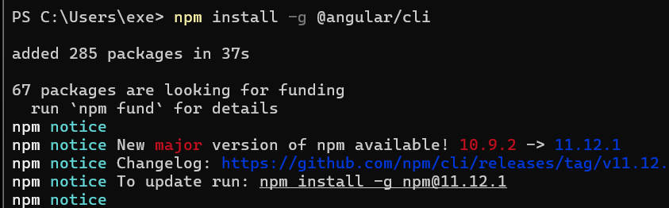

### Vérification de l'installation :

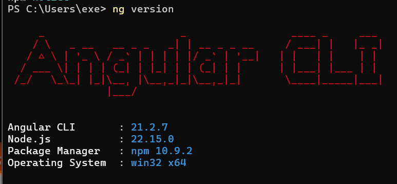

### Création du projet Angular

La commande utilisée pour générer le projet est :

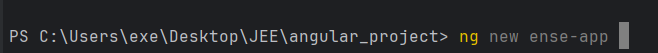

Cette commande génère automatiquement :

- la structure du projet
- les fichiers de configuration
- les dépendances nécessaires
### Lancement du serveur de développement

Pour exécuter l'application localement :

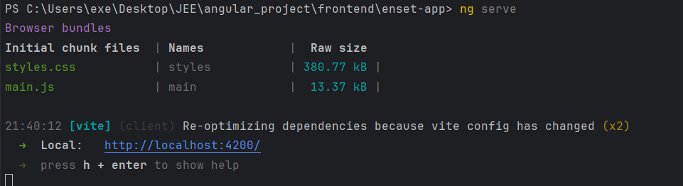

### Installation de Bootstrap

Afin d'améliorer le design de l'application, nous avons installé Bootstrap.

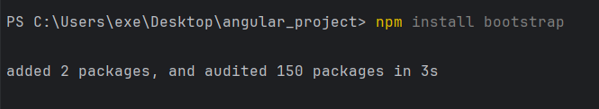

Il existe deux méthodes principales pour ajouter Bootstrap dans un projet Angular :

1. Via le fichier angular.json

On ajoute le fichier CSS de Bootstrap dans la section styles :

2. Via le fichier styles.css global

On peut aussi importer Bootstrap directement dans le fichier de style  global :

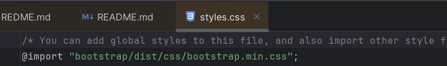

### Exploration et compréhension de la structure du projet

Après la création du projet, nous avons analysé la structure générée automatiquement par Angular CLI.

-  comment Angular est structuré
-  comment l'application démarre
-  comment les composants sont organisés

### Test de l'AppComponent

Nous avons testé le composant principal de l'application (AppComponent) pour vérifier que l'application fonctionne correctement.

L'application se lance correctement
Le composant principal est affiché dans le navigateur

### Création des composants Home et Products

Ensuite, nous avons créé les premiers composants de l'application.

- Création du composant Home

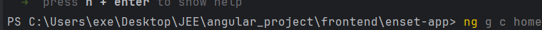

- Création du composant Products

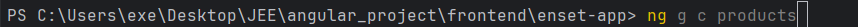

### Mise en place du Routing (Home & Products)

Dans cette étape, nous avons configuré le routing de l'application afin de naviguer entre les pages Home et Products.

1. Configuration des routes

Les routes de l'application sont définies dans le fichier app.routes.ts.

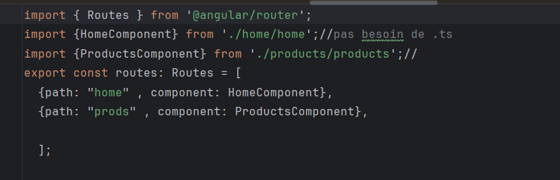

2. Activation du routing dans l'application

Le routing est activé dans le fichier app.ts (AppComponent) en important les modules nécessaires.

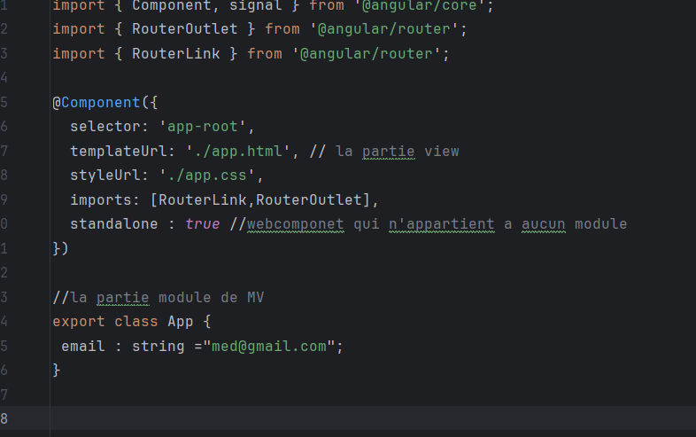

3. Ajout dans le template principal

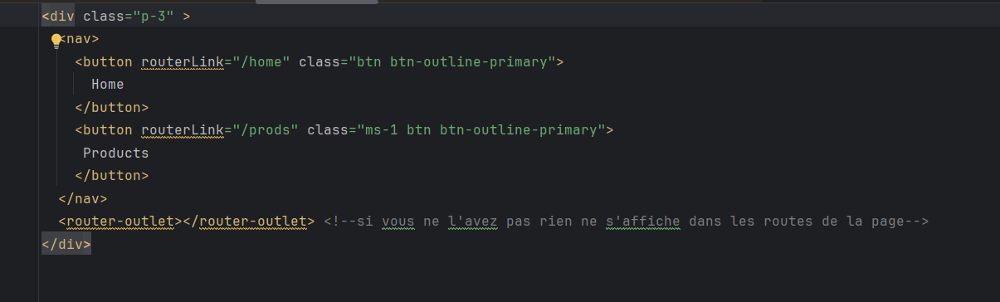

Dans le fichier app.html, nous avons ajouté la zone d'affichage dynamique :

Rôle du router-outlet :

Il permet d'afficher dynamiquement les composants selon la route sélectionnée.

### Création du composant Products avec des données statiques

Dans cette étape, nous avons développé le composant Products dans Angular afin d'afficher une liste de produits.

1. Définition des données statiques

Dans le fichier products.ts, nous avons créé une liste de produits sous forme de tableau statique.

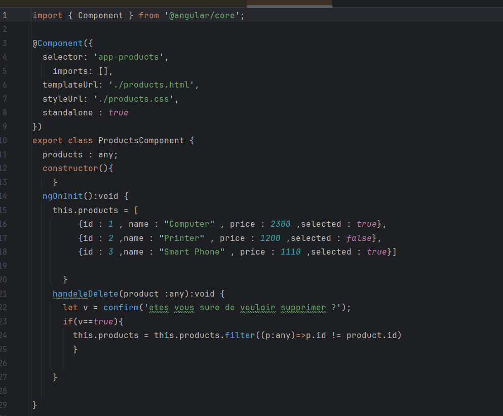

Ces données sont utilisées pour simuler une source de données avant l'intégration d'un backend.

2. Affichage dans le template HTML

Dans le fichier products.html, nous avons affiché les produits dans un tableau.

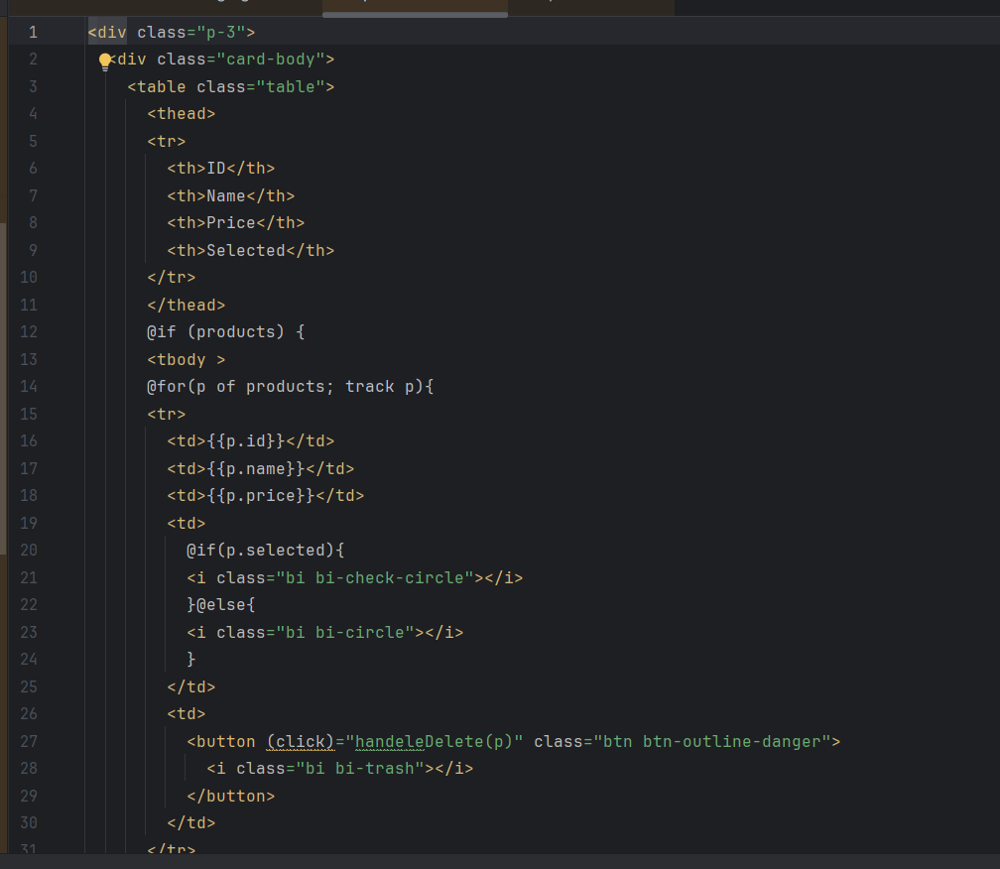

Utilisation des directives Angular
- @for → pour parcourir la liste des produits
- @if → pour afficher conditionnellement certaines informations
### Création du Service et évolution vers une architecture backend
1. Création du service

Dans cette étape, nous avons introduit un service Angular afin de centraliser la logique métier et préparer la communication avec un backend.

Objectif
- Séparer la logique métier du composant
- Rendre le code plus maintenable
- Préparer l'intégration avec une API backend
2. Version initiale (sans backend)

Au départ, le service utilisait des données statiques.

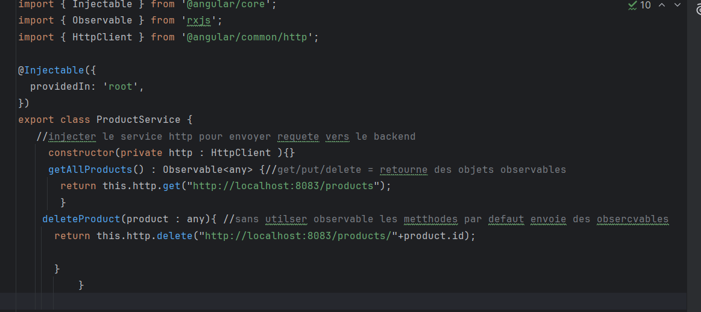

produitComponent maintenant utilse Productservice

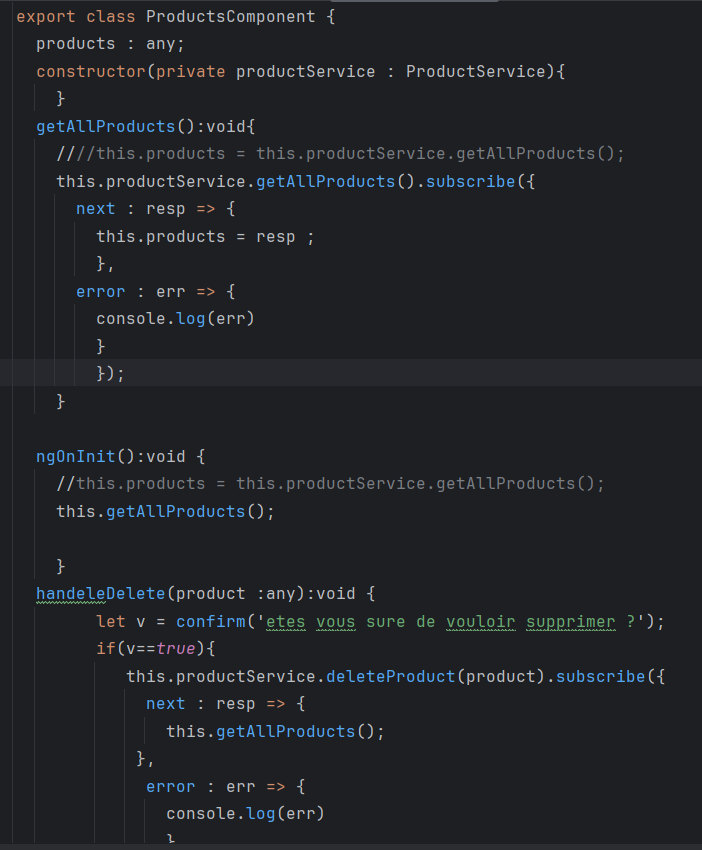

3. Intégration du backend (API REST)

Dans cette étape, nous avons connecté l'application à un backend via HTTP.

Modifications apportées
- Utilisation de HttpClient
- Introduction des Observable
- Communication avec une API REST
- Suppression et récupération des données depuis le serveur

  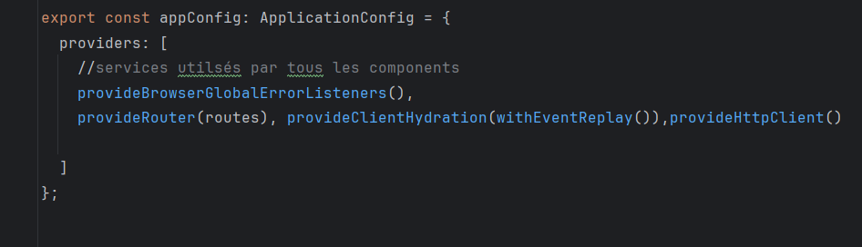

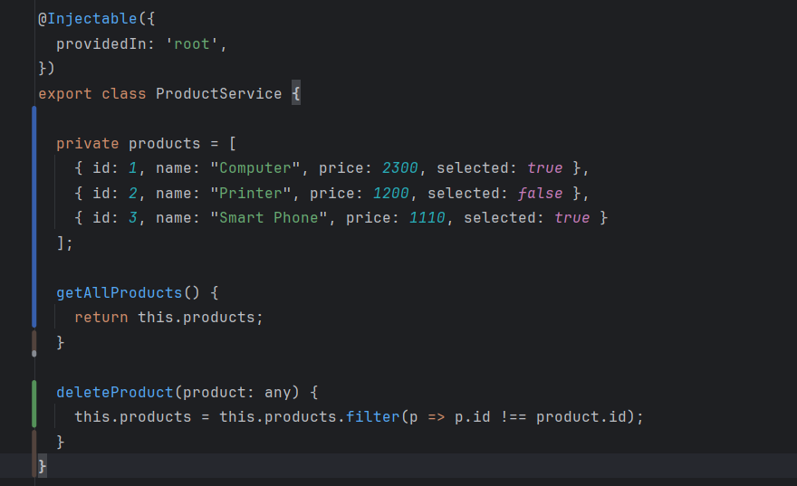

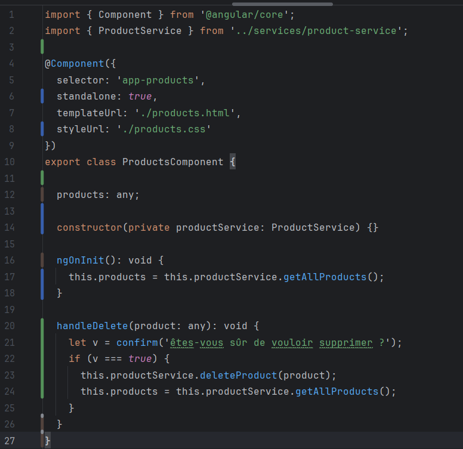

## L'interface de l'application

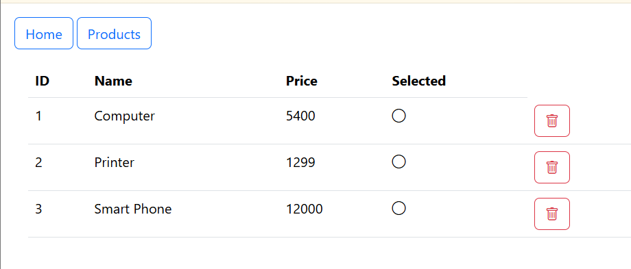